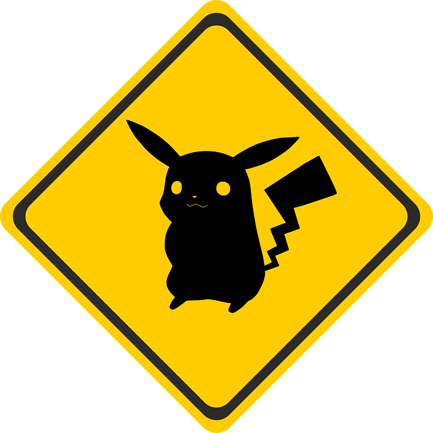

# Diversity Indices in R
The aims of this exercise are to learn how to use R to estimate diversity indices and species accumulation curves. You will need some of these functions to complete your paleoecology assessment. We will be using some made up data about Pokemon sightings within the Museum.

## Before you start
- Open the `02-DiversityIndices.RProj` file in the `02-DiversityIndices` folder to open your R Project for this exercise.
- Make yourself a new R script for your code.

You will also need to install the following packages: 

* `vegan`
* `picante`
* `knitr`

## Preparation
To begin we need to load the packages for this practical.

```{r, message = FALSE}
# Load the packages
library(vegan)
library(picante)
library(knitr)
```

## What are diversity indices?
A diversity index is a measure of the "diversity" of an area. *Diversity* could be measured in terms of the numbers of species (or higher taxonomic groupings like genera, families, phyla), or other metrics such as number of haplotypes if you're interested in genetic diversity, or number of functional groups for studies of functional diversity.

Many diversity indices also account for how evenly spread these different types are.
For example, they identify whether there are there five species with 10 individuals of each (even), or five species with one species with 96 individuals and four species with one individual each (uneven). These differences in evenness may be as important for ecosystem function as the number of species.

There are about a million different diversity indices (OK this is a slight exaggeration but there are a lot, check out the [vegan package](https://cran.r-project.org/web/packages/vegan/vegan.pdf) vignette and search for "diversity"), and different people prefer different measures for different questions. Amusingly the `vegan` help file for the function `diversify` states *"these indices are all very closely related @hill1973diversity, and there is no reason to despise one more than others (but if you are a graduate student, don't drag me in, but obey your Professor's orders)"*.

### $\alpha$, $\beta$ and $\gamma$ diversity

These concepts were originally proposed by @whittaker1960vegetation and expanded in @whittaker1972evolution.

* $\alpha$ (alpha) diversity is the mean species diversity in sites or habitats at a local scale. 
* $\beta$ (beta) diversity is turnover in $\alpha$ diversity among different sites.
* $\gamma$ (gamma) diversity is diversity at the landscape level.

For example, if we count the species in Hyde Park and Green Park, we'd have a measure of $\alpha$ diversity for each. $\beta$ diversity would measure the difference between species found in Hyde Park and those found in Green Park. $\gamma$ diversity would be all the species found across London. $\beta$ diversity is the hardest to measure, and there are far more metrics for measuring this than any others.

## Practical example using Pokemon...
We're going to play around with some invented data on sampling sites within the Museum and the Pokemon we've managed to find there (don't complain about my unlikely Pokemon combinations, they're just made up data with Pokemon names rather than A, B, C etc!). 




First read in the data and take a look at it. 
```{r}
# Read in the dataset
pokemon <- read.csv("data/pokemon-communities.csv")
```

```{r}
# Look at the data
# I used kable from the knitr package so it makes a nice neat table
kable(pokemon)
```

For the `vegan` functions to work you need a matrix where the columns are the species names, the rows are the communities, and the contents of the matrix are the numbers of each species found at each site (or presence absence data as 0s and 1s). We can use the `sample2matrix` function in `picante` to do this easily.

Note that this only works if your first variable is the name of the site, your second is abundance and your third is the names of the species present.

```{r}
# Create a matrix we can use with vegan
pokemon.matrix <- sample2matrix(pokemon)

# Look at the matrix
kable(pokemon.matrix)
```

## Species diversity indices

### $\alpha$ diversity
The simplest measure of $\alpha$ diversity is just the number of species in each site. 
You can easily extract this as follows.

```{r}
specnumber(pokemon.matrix)
```

Simpson's and Shannon's diversity indices can be estimated using the function `diversity`.

```{r}
# Simpson's index
diversity(pokemon.matrix, index = "simpson")
```

```{r}
# Shannon's index
diversity(pokemon.matrix, index = "shannon")
```

### $\beta$ diversity
The function `betadiver` allows you to estimate all the $\beta$ diversity indices mentioned in @koleff2003measuring. For help on which indices are included type:

```{r}
betadiver(help=TRUE)
```

Note that some of these are similarity indices, and some are dissimilarity indices.
See @koleff2003measuring for more details. Two commonly used similarity indices are Jaccard's index and Sorenson's index which can be estimated as follows (note that completely different communities get a score of 0):

```{r}
# Jaccard's index
betadiver(pokemon.matrix, method = "j")
```

```{r}
# Shannon's index
betadiver(pokemon.matrix, method = "sor")
```

Note that the outputs here are pairwise matrices, as these indices measure the similarity among each pair of sites. You can estimate Whittaker's original version using `method = "w"` (this is a dissimilarity method so completely different communities get a score of 1).

```{r}
# Whittaker's betadiversity index
betadiver(pokemon.matrix, method = "w")
```

### $\gamma$ diversity
In this example, $\gamma$ diversity is the total number of species found across all sites. We can very simply calculate this in R using the following code:

```{r}
# How many unique species are there?
length(unique(pokemon$Species[pokemon$Abundance > 0]))

# To view unique species
unique(pokemon$Species)
```

Note that the `[pokemon$Abundance > 0]` bit of the code ensures we don't count species where we have them in the species list, but their abundance at all sites is zero.

## Species accumulation curves (Colwell & Coddington 1994)
Often when we talk about species diversity we're interested in the total diversity of an area or a site. For example, if we want to conserve a patch of woodland, we might need to know how many species in total live there. Sounds easy enough right? 
Just go out and sample the heck out of that woodland...

The problem of course is that sampling is time consuming and expensive, and in conservation we don't have much time or money. In addition, completely sampling all species in an area is difficult, especially for small, rare, shy species. Instead we often estimate species richness by various means. Species accumulation curves are one way to do this.

Species accumulation curves are graphs showing the __cumulative number of species__ recorded in an area or site as a function of the __cumulative sampling effort__ taken to search for them. Sampling effort can be number of quadrats, number of hours of sampling etc. for $\alpha$ diversity, or number of sites if trying to get an estimate of $\gamma$ diversity.

The idea is that as you sample more, you should get closer to discovering all the species in the area. The first few samples you take will probably have lots of species you haven't recorded yet, but this rate of discovery should slow down. Eventually you hope that you'll stop finding any new species to record so the curve will asymptote, but in reality sampling is rarely that thorough. Luckily we can use species accumulation curves to estimate where the curve would asymptote if we kept on sampling.

### Pokemon species accumulation curves
Let's try this for our Pokemon, how many species might be hiding in the Museum if we sampled thoroughly?

We can use the `pokemon.matrix` we've already created and estimate the accumulation curve using the `vegan` function `specaccum`. There are lots of methods for estimating these curves but we will use `method = "random"`. This works as follows.

It randomly selects a site and calculates the initial richness, then randomly selects a second site and calculates the cumulative richness (i.e. the second site plus the first site), and repeats this until all the sites have been used. It then repeats this process 1000 times. You can change the number of times it does this using `permutations` but 1000 is about right - too few and the curves are not smooth, too many and it takes ages. The function outputs the mean cumulative richness and standard deviations for across all 1000 permutations. We do this because our curve will look different depending on which site we start with, and so will give a different total richness estimate. Randomising the order helps us get a better estimate of the total richness, and the standard error on that estimate.

To do this for our Pokemon: 
```{r}
# Fit species accumulation curve
pokemon.curve <- specaccum(pokemon.matrix, method = "random", permutations = 1000)

# Look at the results
pokemon.curve
```

```{r}
# Plot the curve
plot(pokemon.curve, ci.type = "poly", col = "blue", ci.col = "lightblue", 
     lwd = 2, ci.lty = 0, xlab = "number of sites", 
     ylab = "cumulative number of Pokemon species")
```

`"ci.type = "poly"` tells R that you want a shaded area showing the confidence intervals from your randomisations. You can play around with the colours etc. if you want to.

For those of you who prefer to use ggplot, we can plot these curves as follows. Note that because ggplot works with dataframes we first need to create a dataframe from the `pokemon.curve` object. Also we use standard deviation * 1.96 to get the confidence intervals.

```{r}
# Load ggplot
library(ggplot2)
# Make a new dataframe
pokemon.curve.df <- data.frame(sites = pokemon.curve$sites,
                               richness = pokemon.curve$richness,
                               sd = pokemon.curve$sd)

# Plot
ggplot(pokemon.curve.df, aes(x = sites, y = richness)) +
  # Add line
  geom_line() +
  # Add confidence intervals
  geom_ribbon(aes(ymin = richness - 1.96*sd, ymax = richness + 1.96*sd), 
              alpha = 0.5, colour = "grey") +
  # Remove grey background
  theme_bw(base_size = 14)
```

To demonstrate why we need the randomisations, look at two curves for just one permutation each.
```{r}
# Fit one curve with just one permutation
pokemon.curve1 <- specaccum(pokemon.matrix, method = "random", permutations = 1)
# Fit another curve with just one permutation
pokemon.curve2 <- specaccum(pokemon.matrix, method = "random", permutations = 1)

# Set the plotting window so we can plot two plots
par(mfrow = c(1,2))

# Plot the first curve
plot(pokemon.curve1,  
	xlab = "number of sites", ylab = "cumulative number of Pokemon species")

# Plot the second curve
plot(pokemon.curve2, 
	xlab = "number of sites", ylab = "cumulative number of Pokemon species")

# Reset the plotting window so we see just one plot again
par(mfrow = c(1,1))
```

Finally to estimate total species richness across all sites we can (again) use many different metrics. Some common ones include Chao 2 [@chao1987estimating], Jackknife and Bootstrapping approaches and these are easy to estimate using the `vegan` function `specpool`.

```{r}
# Estimate diversity
specpool(pokemon.matrix)
```

Estimates range from 10.9 $\pm$ 0.75 (boot) to 11.8 $\pm$ 3.39 (chao). So we can be fairly confident there are between 10 and 15 ($11.8 + 3.39 = 15.19$) Pokemon in the Museum.

## Practical exercise
In the data folder there is another (invented) dataset using British bats called `bat-communities.csv`. Read in the data, manipulate it as required by `vegan`, then answer the following questions.

1. Which site has the fewest species?

2. How many different species are there in total?

3. What is Simpson's diversity index for Site J?

4. Draw a species accumulation curve for the bats and estimate the total number of species. If you round up numbers with decimal places, what is the maximum number of species estimated by any metric?