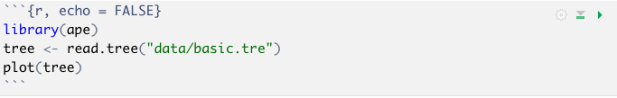

# Methods in Macroecology and Macroevolution Course Materials

The material in this repository is designed to be used as practical exercises for my (one week full-time) Masters level module on *Methods in Macroecology and Macroevolution*. For various reasons this has mostly become a course on phylogenetic comparative methods in R. 

The exercises are versions of materials I've developed over the years, but this most recent iteration was designed to support the *Primer on Phylogenetic Comparative Methods for the Biological Sciences* by Natalie Cooper and Rob P Freckleton, which is part of the new *Oxford Biology Primer series. Primers in Ecology and Evolutionary Biology*. In places the materials refer to this *Primer*. But you won't need the *Primer* to run the exercises. 

The *Primer* is a work in progress but we are hoping it will be published in 2021/22. This repo is for people who want to use the materials now. As such not all sections are fully completed, for example some references are not included because the papers are still in prep! There will eventually be a nice fully completed version of these materials to go with the *Primer*! 

> If you spot any errors, issues, mistakes, omissions etc. Please email me (natalie.cooper@nhm.ac.uk) or add an issue to the repo and I'll try and fix it.

All practical exercises use R (R Core Team 2020), so some knowledge of R is required. I have provided the basics in the first chapter. The online workbook focuses on practical implementations of methods for the most part. For information on the theoretical underpinnings of the topics covered here please refer to the lectures and/or *Primer*. 

## Link to the online workbook
You can access the online workbook for these materials [here](https://github.com/nhcooper123/macro-module-2020/tree/master/data_book/index.html).

## Datasets and scripts
All datasets, trees, R scripts (as R Markdown/.Rmd files), and an R Project (`.Rproj`) file for each exercise are available for download as a ZIP from [here](https://minhaskamal.github.io/DownGit/#/home?url=https://github.com/nhcooper123/macro-module-2020/tree/master/Cooper_Macro_Practicals). When you click this link it will take you to a website and the download should start automatically. **Don't forget to **unzip** this before starting.** The data/trees and scripts are in the appropriate folder for each practical exercise. Note that there is a folder for each of the exercises in the workbook.

## How to use these materials
It is possible to use these materials in a number of ways.

1. Follow the [online workbook](https://github.com/nhcooper123/macro-module-2020/tree/master/data_book/index.html) in a web browser, copy-pasting code into an R script and then running it in the R console.

2. Open the .Rmd (R Markdown) file for each exercise in RStudio and use it as an RNotebook. This allows you to run chunks of code in the script and for the results to appear below the code. You need to open the .Rmd file in folder for that exercise. 

To run the code, you just click the little green triangles to the far right of each code chunk (grey boxes with R code in them) to run the code as shown below. 

The outputs, graphs and results will all appear in the .Rmd file underneath the code, as shown below. 

This is probably the best way to learn these methods. Note, however, that some of the formatting will look a bit weird. For example to get RMarkdown to output the Greek letter lambda we type $\lambda$. If you want to use these files I'd recommend also opening the [online workbook](https://github.com/nhcooper123/macro-module-2020/tree/master/data_book/index.html) in a web browser so if anything looks odd you can check what it is meant to look like!

3. All the code and outputs are shown in the [online workbook](https://github.com/nhcooper123/macro-module-2020/tree/master/data_book/index.html), so you can also use this as a reference and then use the code to complete the practical exercises at the end of each chapter, or to apply them to your own data. This might be a good solution if you're using these materials to learn something specific and don't need practice with R or PCMs.

## Acknowledgments
Thanks to the many generations of students who have taken courses with me and helped me to hone these materials. And to the many others out there teaching PCMs and writing tutorials that helped me learn these methods in the first place, especially Luke Harmon, Brian O'Meara, Dave Orme, Sam Price, Dan Rabosky, Liam Revell and Graham Slater. Also thanks to you for test running this version of these materials.

Particular thanks to the authors of the R packages used and cited in this workbook. None of this would be possible without them. __Do not forget to cite the packages you use in your own work__. And if you meet one of the package authors in person, buy them a beer/cake/coffee to say thank you!

Best of luck to you all, and happy PCM-ing!
