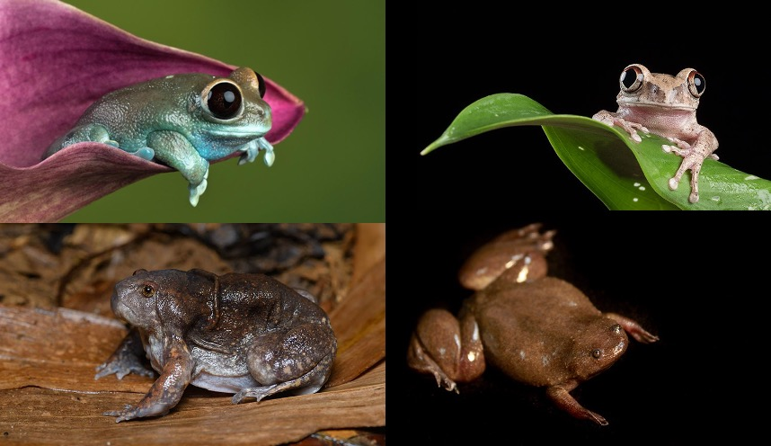
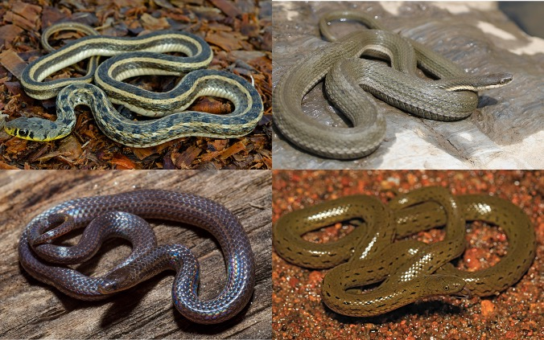
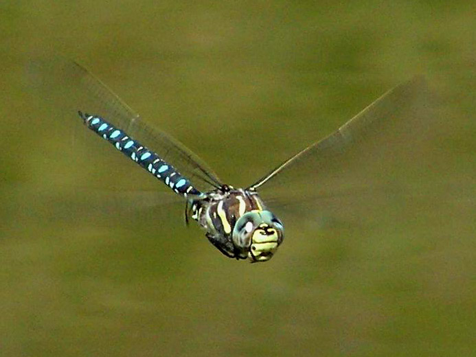

--- 
title: "Practical exercises for Methods in Macroecology and Macroevolution module"
subtitle: "Modified from the Online Materials to Primer on Phylogenetic Comparative Methods for the Biological Sciences"
author: "Natalie Cooper"
site: bookdown::bookdown_site
output: bookdown::pdfbook
documentclass: book
bibliography: [book.bib, packages.bib]
biblio-style: apalike
link-citations: yes
colorlinks: yes
---

```{r include=FALSE}
# automatically create a bib database for R packages
knitr::write_bib(c(
  .packages(), 
  'bookdown', 'knitr', 'rmarkdown', 'phytools', 'tidyverse', 'caper', 'ape', 'measurements',
  'patchwork', 'ggtree', 'geiger', 'treeplyr'), 'packages.bib')
```

# Preface {-}

The material in this online book is designed to be used as practical exercises for my (one week full-time) Masters level module on *Methods in Macroecology and Macroevolution*. For various reasons this has mostly become a course on phylogenetic comparative methods in R. 

The exercises are versions of materials I've developed over the years, but this most recent iteration was designed to support the *Primer on Phylogenetic Comparative Methods for the Biological Sciences* by Natalie Cooper and Rob P Freckleton, which is part of the new *Oxford Biology Primer series. Primers in Ecology and Evolutionary Biology*. In places the materials refer to this *Primer*. But you won't need the *Primer* to run the exercises.

All practical exercises use R [@rcoreteam2020], so some knowledge of R is required. I have provided the basics in the first chapter. The online book focuses on practical implementations of methods for the most part. For information on the theoretical underpinnings of the topics covered here please refer to the lectures and/or *Primer*. 

## Datasets and scripts {-}
All datasets, trees, R scripts (as R Markdown/.Rmd files), and an R Project (`.Rproj`) file for each exercise are available XXX. The data/trees and  are in the appropriate folder for each practical exercise. To work through the exercises you need to download all the files into a folder somewhere on your computer. Don't forget to **unzip** this before starting. Note that there is a folder for each of the exercises in the book.

## How to use these materials {-}
It is possible to use these materials in a number of ways.

1. Follow this online book, copy-pasting code into an R script and then running it in the R console.
2. Open the .Rmd (R Markdown) file for each exercise in RStudio and use it as an RNotebook. This allows you to run chunks of code in the script and for the results to appear below the code. You need to open the .Rmd file in folder for that exercise. You can then just click the little green play buttons to the far right of each code chunk (grey boxes with R code in them) to run the code. The outputs, graphs and results will all appear in the .Rmd file underneath the code. This is a good way to learn/teach these materials. See [here](http://rmarkdown.rstudio.com/r_notebooks.html) for more details.
3. All the code and outputs are shown in this book, so you can also use this as a reference and then use the code to complete the practical exercises at the end of each chapter, or apply them to your own data, rather than running all the code in the book.

## Boxes {-}
Throughout the book are boxes of text highlighting particularly important issues:

```{block, type="info"}
**Information** boxes. These boxes highlight important details. These boxes may also show you how to solve problems that may not affect every user.
```

```{block, type="detail"}
**Extra details** boxes. These boxes contain detailed explanations of things for those who like to fully understand the complexities of what they are doing, for example technical details of the code that I have not explained in detail in the text.
```

```{block, type="warning"}
**Caveats** boxes. These boxes highlight important points that need to be considered when working through your own analyses. They reveal areas where it is important to be careful and think about what you are doing and **why**. The image is a Jurassic Park era velociraptor to remind you of the "Jurassic Park caveat", i.e. that just because you *can* perform an analysis in R doesn't mean that you *should* (thanks to Dr Ian Malcolm and Dr Michael Crichton)! Always consider the question at hand, your study group, and the quality of the data you are using before embarking on a new comparative analysis. 
```

## Example datasets {-}
I've tried to keep my examples to a minimum so that you have chance to get familiar with the trees and data. As such there are just three main example datasets in this book. In each case I've removed a few species and a few variables to make things a bit more straightforward. __If you want to use these datasets for your own work you should download the data from the publications listed to get the complete datasets__.

Apologies in advance to the non-vertebrate, non-animal fans out there. If it helps just replace the word frog with fly, snake with sponge, and dragonfly with grass. It won't alter the R code.

### Frog eye size evolution {-}



Who doesn't love frogs? Frogs are cool. One of the coolest things about them is that they have weird bulgy eyes...or do they? Some species have teeny tiny eyes, while others have massive eyes. In fact frogs have some of the biggest eyes relative to their body size across all vertebrates. @thomas2020eye predicted that this variation might be due to where they live, their mating habits, the time of day they are active, and their body size. In our examples we'll test some of these hypotheses using phylogenetic comparative methods.

The data and modified tree for the XX species in this example come from @thomas2020eye, and the original tree comes from @feng2017phylogenomics. If you want to see the full results check out @thomas2020eye! And there's a nice summary of the paper [here](https://www.nhm.ac.uk/discover/news/2020/september/frogs-have-some-of-the-biggest-eyes-amongst-vertebrates.html).

### Natricine snake head shape evolution {-}



Snakes are also cool, especially natricines which are the group that contains both the delightful European grass snake (*Natrix natrix*) and the ubiquitous garter snakes (genus *Thamnophis*) of North America. Natricine snakes are found across the globe, and have a range of interesting ecologies and more morphological variation than you might expect, especially in their head shape. Deepak [CITE PAPER] predicted that these variations in head shape would be more closely related to the ecomorph they belonged to (i.e. whether the snake was terrestrial, aquatic, burrowing or aquatic burrowing) than their evolutionary history. They expected that head shape might be an example of convergent evolution. In our examples we'll test some of these hypotheses using phylogenetic comparative methods.

The data for the XX species in this example comes from DEEPAK [CITE PAPER], and the tree comes from DEEPAK [CITE PAPER]. If you want to see the full results check out DEEPAK [CITE PAPER]! And there's a nice summary of the paper [here]().

### Diversification in dragonflies {-}



You've probably guessed that yes, dragonflies are also cool. They're incredible predators and extremely agile fliers. My favourite fact about dragonflies is that one species, the globe skimmer (*Pantala flavescens*) make an annual multi-generational migration of around 18,000km (!) with individual insects flying more than 6,000km (thanks to Dr Jessica Ware for that fact and this dataset!). Dragonflies today are generally found near water, with some preferring lotic habitats with fast flowing waters and others lentic habitats with slow moving waters. The clade has been around for over 300 million years, and currently has over 3000 species. But how quickly did they diversify? Do different clades have different rates of evolution? Do their habitat preferences influence their diversification rates? In our examples we'll test some of these questions using phylogenetic comparative methods.

The 522 species tree for this example comes from @letsch2016not and is available to download from @letsch2016data. This paper looked across dragonflies to investigate whether species from lotic habitats with fast flowing waters diversify more rapidly than species from lentic habitats with slow moving waters. If you want to see the full results check out @letsch2016not! 

## Citing R and R packages {-}
Lots of people work on R and R packages for free. They're the reason that R is so great! The best way to thank them for this selfless work is to **cite R, and any R packages that you use**, whenever you write a report, article, thesis chapter or paper. This means that R developers can show their funders, bosses, supervisors and potential employers that people are using their work. 

The citation for R will usually look something like this

> All analyses used R version 4.0 (R Core Team 2020). 

Your version number might be different (4.0 is the current version at the time of writing this book). You only need to do this once, usually in the methods section. The full citation for the bibliography is usually something like: 

> R Core Team (2020). R: A language and environment for statistical computing. R Foundation for Statistical Computing, Vienna, Austria. URL https://www.R-project.org/.

If you don't remember this, or can't work out what version of R you are using, the R folk have you covered. To get the citation you can use:
```{r}
citation()
```

To get the version of R you can use:
```{r}
R.Version()$version.string
```

You can also look at more version information by running:
```{r, eval = FALSE}
R.Version()
```

I've suppressed the output here as it will be different for every user. The version number is near the bottom of the output. You'll also see one of the fun things about R here which is that each version has a nickname, all of which are the titles of Peanuts comics! For more info see this [slackoverflow discussion](https://stackoverflow.com/questions/13478375/is-there-any-authoritative-documentation-on-r-release-nicknames/36694119#36694119).

What about R packages? You should cite these at the relevant points in your methods section. For example, for `caper`(we'll return to what this does later in the book) we might write

> We fitted phylogenetic generalised least squares (PGLS) models using the R package caper version 1.0.1 (Orme et al. 2018).

To find out what the citation is for an R package we also use the function `citation` but this time specify the package
```{r}
citation(package = "caper")
```

Usually package citations contain the version number, but if not you can get the version using 
```{r}
packageVersion("caper")
```

An additional benefit to citing R packages is that it helps people understand exactly what you did. It's possible there are multiple ways to run a PGLS model, but if your report says you used `caper`, it's easy for a reader to check how `caper` does it and to know exactly what you did. This helps people reproduce your analysis, and can also help you prove to anyone assessing your work that you know what you are doing!

## Acknowledgements {-}
Thanks to the many generations of students who have taken courses with me and helped me to hone these materials. And to the many others out there teaching PCMs and writing tutorials that helped me learn these methods in the first place, especially Luke Harmon, Brian O'Meara, Dave Orme, Sam Price, Dan Rabosky, Liam Revell and Graham Slater Also thanks to XXXX for test running this version of these materials.

Particular thanks to the authors of the R packages used and cited in this book. None of this would be possible without them. __Do not forget to cite the packages you use in your own work__. And if you meet one of the package authors in person, buy them a beer/cake/coffee to say thank you!

Best of luck to you all, and happy PCM-ing!